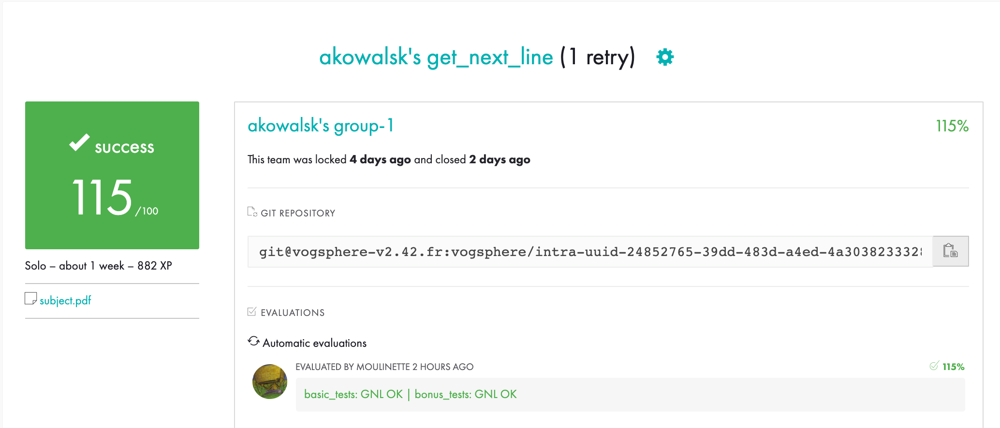

# get_next_line

>This project will not only allow you to add a very convenient function to your collection,
>but it will also allow you to learn a highly interesting new concept in C programming:
>static variables.

The goal of this project was to write a function called get_next_line(), which allows you to read the text from a File Descriptor one line at a time. Running this function in a while loop will let you read entire files.
 - In order to test the project, you can download the files and then compile with the follow:
   - `gcc -Wall -Wextra -Werror -D BUFFER_SIZE=32 get_next_line.c get_next_line_utils.c main.c -I. -o gnl_tester`
 - This will provide and executable called `gnl_tester` which you can run in your terminal to read a file like so `./gnl_tester "example_file.txt"` or simply run `./gnl_tester` to read from the standard input.
 - Also, you can adjust the BUFFER_SIZE variable during compilation, and the BUFFER_SIZE determines how many bytes the read() function reads each time it is called.

### Reading from a file
```sh
$ cd folder_where_you_downloaded
$ gcc -Wall -Wextra -Werror -D BUFFER_SIZE=32 get_next_line.c get_next_line_utils.c main.c -I. -o gnl_tester
$ ./gnl_tester "example_file.txt"
```

### Reading from standard input
```sh
$ cd folder_where_you_downloaded
$ gcc -Wall -Wextra -Werror -D BUFFER_SIZE=32 get_next_line.c get_next_line_utils.c main.c -I. -o gnl_tester
$ ./gnl_tester
```


### Testers I would recommend for future students:
 - https://github.com/Mazoise/42TESTERS-GNL.git
 - https://github.com/charMstr/GNL_lover.git 
 - https://github.com/Tripouille/gnlTester.git
 - https://github.com/mrjvs/42cursus_gnl_tests.git
