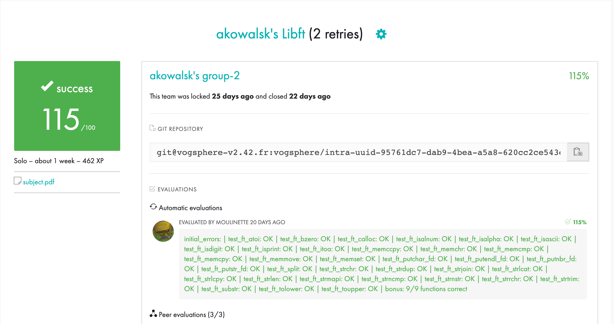

# libft

>Summary: The aim of this project is to code a C library regrouping usual functions that
>you’ll be allowed to use in all your other projects.

## The goal of this project was to rewrite the following functions for use on future projects at 42.
### libc Functions
	- atoi()
	- bzero()
	- calloc()
	- isalnum()
	- isalpha()
	- isascii()
	- isdigit()
	- isprint()
	- memchr()
	- memcmp()
	- memcpy()
	- memccpy()
	- memmove()
	- memset()
	- strchr()
	- strlcat()
	- strlcpy()
	- strdup()
	- strlen()
	- strncmp()
	- strnstr()
	- strrchr()
	- tolower()
	- toupper()

### String Functions

	- ft_itoa()
	- ft_putchar_fd()
	- ft_putendl_fd()
	- ft_putnbr_fd()
	- ft_putstr_fd()
	- ft_split()
	- ft_strjoin()
	- ft_strmapi()
	- ft_strtrim()
	- ft_substr()

### Bonus Part (Linked Lists)

	- ft_lstadd_back()
	- ft_lstadd_front()
	- ft_lstclear()
	- ft_lstdelone()
	- ft_lstiter()
	- ft_lstlast()
	- ft_lstmap()
	- ft_lstnew()
	- ft_lstsize()

### Creating the library
```sh
$ cd folder_where_you_downloaded
$ make re
$ gcc -Wall -Wextra -Werror -o your_executable.exe libft.a your_file.c
```

### Creating the library with bonus functions
```sh
$ cd folder_where_you_downloaded
$ make bonus
$ gcc -Wall -Wextra -Werror -o your_executable.exe libft.a your_file.c
```

